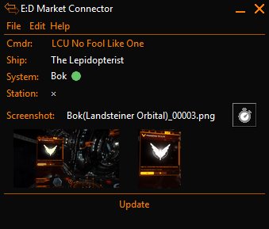

# EDMC-Screenshot
A plugin for EDMC that detects screenshot events are converts them to PNG format

* The plugin takes the existing screenshot file and generate a new name based on the selected mask
* The converted file can be saved to a different directory or drive from the orginal file. 
* The original file can optionally be deleted after conversion
* The plugin can trigger screenshots on a timer
* Displays the image and a preset crop
* Click on the crop so save the crop



# Installation
Download the [latest release](https://github.com/NoFoolLikeOne/EDMC-Screenshot/releases), open the archive (zip) and extract the folder  to your EDMC plugin folder.

To install a downloaded plugin:

* On the Plugins settings tab press the “Open” button. This reveals the plugins folder where this app looks for plugins.
* Open the .zip archive that you downloaded and move the folder contained inside into the plugins folder.

You will need to re-start EDMC for it to notice the plugin.

## Configuration
Go to file/settings and put in: 
* the directory where the screenshots are stored in game
* the directory where you want the converted screenshots to go
* Choose whether to delete the original file
* Group files by system directory
* Hide the user interface
* Choose a file mask 
* Instruct the timer to use High Res Screenshots (not recommended)
* Enable Debugging (not recommended)  C:\Users\YOURUSERNAME\AppData\Local\Temp\EDMarketConnector.log

# To Do
* Add defensive code in case the directories do not exist or are otherwise invalid
* Add option to have a high and low res version when the game saves hi resolution
* Add an options to save thumbnails
* Option to add planetery coordinates to the file name
* Configure additional crops


# Elite Dangerous Screenshot event format

``` Event format
{
  "timestamp": "2017-08-26T03:12:19Z",
  "event": "Screenshot",
  "Filename": "\\ED_Pictures\\Screenshot_0255.bmp",
  "Width": 1920,
  "Height": 1080,
  "System": "Ceos",
  "Body": "New Dawn Station"
}
```
